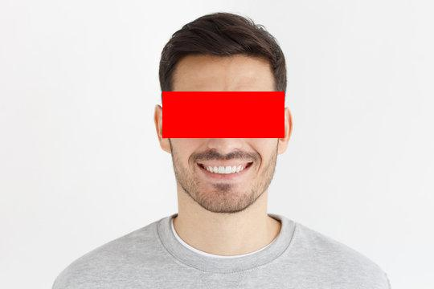

## opencv-censor-bar

Playing around with opencv. This script detects faces and eyes in an input image using [Haar cascades](https://docs.opencv.org/3.4/db/d28/tutorial_cascade_classifier.html), then adds a censor bar over the detected eyes

## Example

### Input Image


### Output Image




### How it works

- Takes an input image file as a command-line argument
- Reads the input image using the OpenCV library
- Detects faces and eyes in the image using Haar cascades
- Converts the OpenCV image to a PIL (Python Imaging Library) image
- Adds a censor bar over the detected eyes in the image
- Saves the modified image with the censor bar as a new file named "output.jpg"


### Usage

```
pip install opencv-python opencv-python-headless pillow

python script.py image.jpg
```


### TODO: Improvements
- Replace Haar cascades with a more accurate model (deep learning based model? MTCNN? pretrained model from Dlib?)
- Add a confidence threshold for the detected faces and eyes to filter out false positives
- Experiment with different values for scaleFactor and minNeighbors to improve face and eye detection
- Preprocess the input image to improve robustness to different lighting conditions, rotations, and scales
- Resize very large images before processing to speed up the detection process
- Search for eyes only within the detected face regions to improve efficiency
- Add error handling for cases where the image file cannot be read, the Haar cascade files cannot be found, or other issues arise during processing


